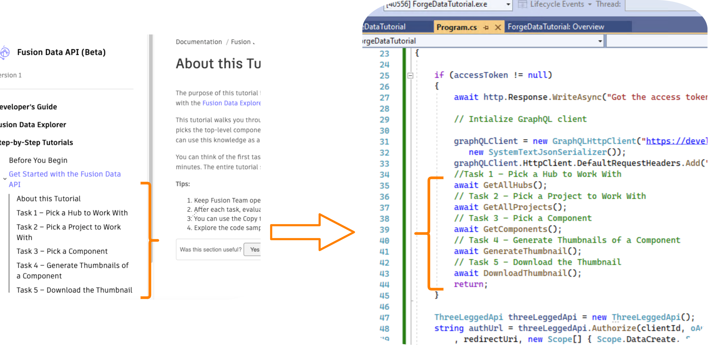

# FusionData_Tutorials


[](http://opensource.org/licenses/MIT)

# Description
This repository conforms to the [Step-by-Step Tutorials](https://forge.autodesk.com/en/docs/fusiondata/v1/tutorials/tutorial-01/) of the Fusion Data API.



## Prerequisites
1. **Forge Account**: Learn how to create a Forge Account, activate subscription and create an app at [this tutorial](http://learnforge.autodesk.io/#/account/);
2. **.NET 6 minimal API**: Please refer to the [documentation](https://docs.microsoft.com/en-us/aspnet/core/tutorials/min-web-api).


## Notes
You will need to set the value of clientId, clientSecret and redirectUri variables in [Program.cs](Program.cs) based on your Forge app's credentials.
Each function conforms to a task in the tutorial. The output of each function, would be used as input to the next one.

## Output
The console window should show the required results.
```
*****Listing all Hubs*****

hubs: {
  "results": [
    {
      "name": "Test_Hub1",
      "id": "a.cGVyc29uYWw6dWUyZGI0ZTE5"
    },
    {
      "name": "Test_Hub2",
      "id": "a.YnVzaW5lc3M6YXV0b2Rlc2s0ODI4"
    }
  ]
}

*****Listing all Projects*****

projects: {
  "results": [
    {
      "name": "New Project",
      "id": "a.YnVzaW5lc3M6YXV0b2Rlc2s0ODI4IzIwMjAwNDEwMjg1MTUyNTMx",
      "rootFolder": {
        "id": "urn:adsk.wipprod:fs.folder:co.-0xvwnGATSyBeM-RVhDliQ",
        "name": "New Project",
        "objectCount": 0
      }
    },
    {
      "name": "My First Project",
      "id": "a.YnVzaW5lc3M6YXV0b2Rlc2s0ODI4IzIwMjAwNDEwMjg1MTUyNTU2",
      "rootFolder": {
        "id": "urn:adsk.wipprod:fs.folder:co.nmNWMmoIRRicW9wTnzVgTQ",
        "name": "My First Project",
        "objectCount": 25
      }
    },    
    {
      "name": "Default Project",
      "id": "a.YnVzaW5lc3M6YXV0b2Rlc2s0ODI4I0QyMDIwMDQxMDI4NTE1MjQ4MQ",
      "rootFolder": {
        "id": "urn:adsk.wipprod:fs.folder:co.nARdlH7DS46UMRVvaftyWw",
        "name": "Default Project",
        "objectCount": 13
      }
    },    
  ]
}

*****Listing Components*****

items: {
  "results": [
    {
      "name": "chair v4",
      "id": "Y29tcH5jby5iUlpxX3F3TVJWLVZCbMUtyejNNNWF1dmZfYWdhfn4"
    }
  ]
}

*****Listing Component Versions*****

item: {
  "name": "chair v4",
  "id": "Y29tcH5jby5iUlpxX3F3TVJWLVZCbGJ6bTdMrazl3Z2xhWU1qMUtyejNNNWF1dmZfYWdhfn4",
  "tipVersion": {
    "id": "Y29tcH5jby5iUlpxX3F3TVJWLVZCbGJ6bTU1qMUtyejNNNWF1dmZfYWdhflZEazRmTEJMMkZON1NJdkxtQldpSEc",
    "name": "chair v4",
    "thumbnail": {
      "status": "SUCCESS"
    }
  }
}
Image downloaded to: C:\Users\AppData\Local\Temp\thumbnail.png
```

## License

This sample is licensed under the terms of the [MIT License](http://opensource.org/licenses/MIT). Please see the [LICENSE](LICENSE) file for full details.

## Written by

Sajith Subramanian, [Developer Advocacy and Support](http://forge.autodesk.com)
